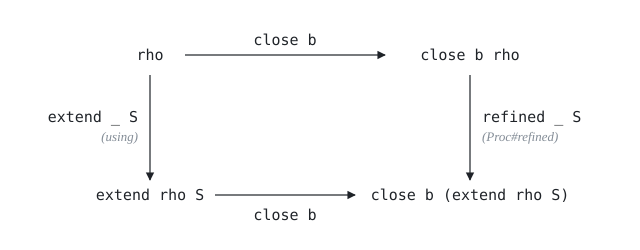

# ruby-refinements-semantics

A small Rocq Prover formalization of the semantics of Ruby's `Proc#refined`
([Feature #22097](https://bugs.ruby-lang.org/issues/22097)), covering the
activation of refinements in a cref and the algebraic laws of `refined`
introduced by the revised design in
[ruby/ruby#18052](https://github.com/ruby/ruby/pull/18052) (zero-argument
application returns the receiver; chained application behaves like a single
application of the concatenated module sequence).

Everything lives in a single file, [`refinements.v`](refinements.v), which
depends only on the Rocq standard library:

```console
$ coqc refinements.v
```

## The model

- A **module** `m : M` refines a set of dispatch keys `k : K`
  (a key abstracts a (class, method) pair), given by
  `refines : M -> K -> bool`.  Modules are compared by a decidable
  equality `eq_dec`.
- A **refinement state** `s : list M` is the refinement part of a
  cref: the active modules, in activation order.  `activate s m`
  appends `m` unless it is already active, mirroring
  `rb_using_refinement`, which returns early for a module already in
  the iclass chain; `apply_seq` folds `activate` over a module
  sequence, mirroring how both sequential `using` and variadic
  `refined` accumulate refinements in a cref.  `lookup s T0 k` is
  last-wins over `s`, falling through to a base table
  `T0 : K -> option M`.
- A **closure** is a pair `(body, env)` where `env` is a refinement
  state.  `refined p S` re-closes the same body over
  `apply_seq env S`; it is non-mutating by construction.

Since activation skips a module that is already active, re-applying a
module does not raise its precedence: `p.refined(a, b, a)` dispatches
to `b`, not `a` (`reactivation_dispatch`), just as `using a; using b;
using a` does.

Deliberately outside the model: iseq copying and memoization, scope
visibility, the `using`-in-body rejection, Ractor concerns, the
lexical scoping of `using` itself, and Procs not created from a Ruby
block, which the implementation still rejects with `ArgumentError`
unless the module sequence is empty.  The model captures what a
refined proc *means*, not how the implementation caches it.

`refined` is the closure-level lift of the `using` action on
environments: the `square` theorem below states that this diagram
commutes.



## Theorems

Statements marked **[PR #18052]** hold only under the revised design.  In
the original one-shot design `refined` was a partial function
(zero-argument and chained calls raised `ArgumentError`), so their
left-hand sides were undefined.  Unmarked statements already hold for
the original design.

| Theorem | Statement | Needs PR #18052 |
| --- | --- | --- |
| `staged_eq_oneshot` | Activating `a ++ b` equals activating `a`, and then `b` on the result | yes (the fold identity is stock; its staged reading requires chaining) |
| `lookup_activate_fresh` | Activating a module not yet active makes it win every key it refines | no |
| `reactivation_noop` | Activating an already active module leaves the state unchanged | no |
| `reactivation_seq`, `reactivation_equiv` | `[a; b; a]` and `[a; b]` are the same state, hence observationally equivalent | no |
| `reactivation_dispatch` | In `[a; b; a]`, `b` still wins the keys both modules refine | no |
| `square` | `refined (close b rho) S = close b (extend rho S)`: refining a closure equals closing over the `using`-extended environment | no |
| `refined_unit` | `refined p [] = p`, definitionally | yes |
| `refined_assoc` | `refined (refined p S1) S2 = refined p (S1 ++ S2)` | yes |
| `refined_uniqueness` | Any operation making the square commute agrees with `refined` everywhere | no |
| `chained_table` | Chained and one-shot refined procs dispatch identically | yes |
| `table_respects_equiv` | Dispatch depends only on the observational equivalence class of the captured sequence | no |

## Correspondence to the implementation

| Model | CRuby |
| --- | --- |
| `apply_seq` | `rb_using_module_recursive` accumulating refinements in a cref (eval.c) |
| `activate` skipping an active module | `rb_using_refinement` returns early for a module already in the iclass chain |
| last-wins in `lookup` | a later `using` / a later `refined` argument takes precedence, unless the module is already active |
| `extend rho S` (`apply_seq env S`) | a chained call stacks new modules on a duplicate of the receiver's cref |
| `refined p [] = p` | `Proc#refined` with no arguments returns the receiver itself |
| `refined_assoc` | `p.refined(a).refined(b)` behaves like `p.refined(a, b)` |
| `seq_equiv` | procs whose crefs activate the same refinements are indistinguishable by dispatch |

The implementation copies the block's iseq for each refined proc, and
memoizes one copy per source iseq, keyed by the receiver's captured
cref and the module arguments.  A chained call is not memoized: its
source is itself a copy, and memo entries are retained for the VM's
lifetime, so caching them would grow the memo without bound.  A
performance warning is emitted for such a call under
`Warning[:performance] = true`.

`p.refined(a).refined(b)` and `p.refined(a, b)` therefore produce
*distinct* copies with equal behavior: the model's equalities
correspond to observational equivalence of procs, not object identity
-- except `refined()`, which returns the receiver itself.
